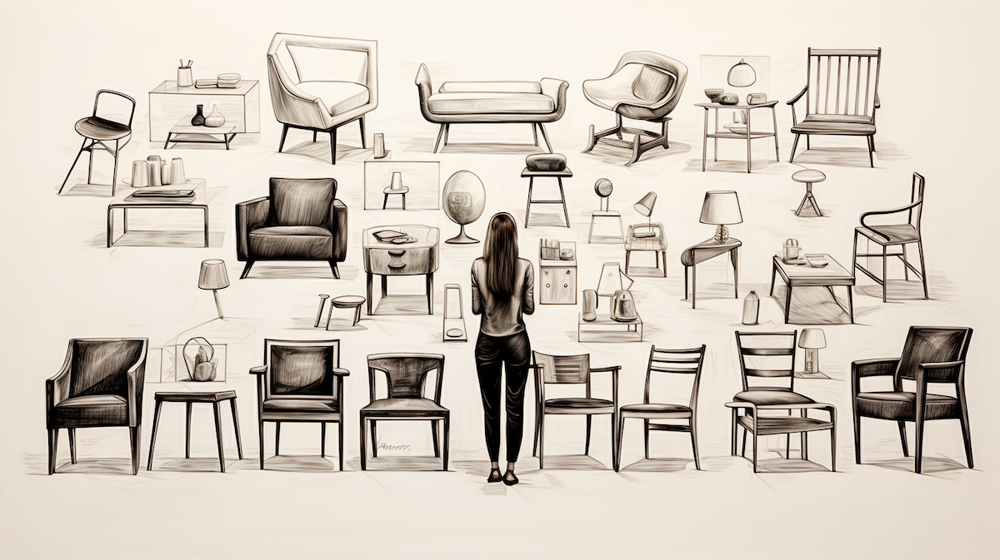

```{r setup, include=FALSE}
usethis::use_git_ignore(c("*.csv", "*.rds"))
options(htmltools.dir.version = FALSE)

library(knitr)
library(tidyverse)
library(xaringan)
library(fontawesome)
```

class: inverse, center, middle

# `r fa("fas fa-images", fill = "#fff")`

**View the slides:** 

[bretsw.com/edf5442-ss24-module1](https://bretsw.com/edf5442-ss24-module1)

---

class: inverse, center, middle

# Standup

```{r, out.width = "100%", echo = FALSE, fig.align = "center"}
include_graphics("img/standup.png")
```

---

class: inverse, center, middle

#  `r fa("fas fa-chair", fill = "#fff")` <br><br> Memories of Being Tested

---

class: inverse, center, middle

#  `r fa("fas fa-chair", fill = "#fff")` <br><br> Stories of Following Curiosity

---

class: inverse, center, middle

# Sorting

```{r, out.width = "100%", echo = FALSE, fig.align = "center"}
include_graphics("img/plinko.png")
```


---

class: inverse, center, middle

# Scrum

```{r, out.width = "100%", echo = FALSE, fig.align = "center"}
include_graphics("img/scrum.png")
```

---

# `r fa("fas fa-chair", fill = "#fff")` Case Study: Chairs

```{r, out.width = "100%", echo = FALSE, fig.align = "center"}

```

<div class="caption">
Inspiration drawn from Stanford d.school's <a href="https://dschool.stanford.edu/resources/the-5-chair-challenge">The 5 Chair Challenge</a>
<br><br>
</div>

### 1. Problems

---

# `r fa("fas fa-chair", fill = "#fff")` Case Study: Chairs

```{r, out.width = "100%", echo = FALSE, fig.align = "center"}

```

*Pass to the group on your left...*

### 2. Assumptions

---

# `r fa("fas fa-chair", fill = "#fff")` Case Study: Chairs

```{r, out.width = "100%", echo = FALSE, fig.align = "center"}

```

*Pass back...*

### 3. Purpose

---

# `r fa("fas fa-chair", fill = "#fff")` Case Study: Chairs

```{r, out.width = "100%", echo = FALSE, fig.align = "center"}

```

*Pass to the group on your right...*

### 4. Questions

---

# `r fa("fas fa-chair", fill = "#fff")` Case Study: Chairs

```{r, out.width = "100%", echo = FALSE, fig.align = "center"}

```

*Pass back...*

### 5. Methods

---

class: inverse, center, middle

# Standup

```{r, out.width = "100%", echo = FALSE, fig.align = "center"}
include_graphics("img/standup.png")
```


---

class: inverse, center, middle

# Solo

```{r, out.width = "100%", echo = FALSE, fig.align = "center"}

```

---

# `r fa("fas fa-chair", fill = "#fff")` Professional Context

```{r, echo = FALSE, out.width = "48%", fig.align = "default", fig.show = "hold"}
include_graphics(c("img/oleary-fig1-1.png", "img/oleary-fig1-2.png"))
```

<div class="caption">
Figures 1.1 and 1.2 from  O'Leary (2005, p. 6, p. 12)
<br><br>
</div>

### 1. Problems

---

# `r fa("fas fa-chair", fill = "#fff")` Professional Context

```{r, out.width = "600px", echo = FALSE, fig.align = "center"}
include_graphics("img/scrum.png")
```

*In your scrum team...*

### 2. Assumptions

- Opportunities & Dilemmas (O'Leary, 2005, Table 1.1, p. 18)
- Unpacking Assumptions (O'Leary, 2005, pp. 28-31)

---

# `r fa("fas fa-chair", fill = "#fff")` Professional Context

```{r, out.width = "600px", echo = FALSE, fig.align = "center"}

```

*Solo again...*

### 3. Purpose

- Resarch [on, for, with] others (O'Leary, 2005, pp. 15-17)
- Aims & Objectives (O'Leary, 2005, pp. 48-49)
- What We Test, Why We Test, and Important Reminders (Salkind & Frey, 2023, pp. 8-13) 

---

# `r fa("fas fa-chair", fill = "#fff")` Professional Context

```{r, out.width = "600px", echo = FALSE, fig.align = "center"}
include_graphics("img/scrum.png")
```

*In your scrum team...*

### 4. Questions

- From Problems to Questions (O'Leary, 2005, pp. 32-36)

---

# `r fa("fas fa-chair", fill = "#fff")` Professional Context

```{r, out.width = "600px", echo = FALSE, fig.align = "center"}

```

*Solo again...*

### 5. Methods

- From Question to Methods (O'Leary, 2005, pp. 49-53)
- Steps in the Development of a Standardized Test (Salkind & Frey, 2023, Table 1.2, p. 14) 


---

class: inverse, center, middle

# Standup

```{r, out.width = "100%", echo = FALSE, fig.align = "center"}
include_graphics("img/standup.png")
```

---

class: inverse, center, middle

# `r fa("fas fa-binoculars", fill = "#fff")` <br><br> Looking ahead

---

# `r fa("fas fa-calendar-day", fill = "#fff")` Semester Schedule

```{r, out.width = "360px", echo = FALSE, fig.align = "center"}
include_graphics("img/across-time.jpg")
```

- **Module 1: Introduction to Inquiry**

- **Module 2:** Reviewing the Literature

- **Module 3:** Planning for Inquiry

- **Module 4:** Measurement: Surveys & Tests

- **Module 5:** Measurement: Interviews

- **Module 6:** Analysis: Quantitative

- **Module 7:** Analysis: Qualitative

- **Module 8:** Ethics & Reporting

---

# `r fa("far fa-keyboard", fill = "#fff")` Major Assignments

```{r, out.width = "240px", echo = FALSE, fig.align = "center"}
include_graphics("img/build.jpg")
```

--

### Individual Assignments (20%)

- **Problem Statement and Annotated Bibliography** (10%) - due in Module 3
- **Test Items** (10%) - due in Module 6

--

### Group Assignments (50%)

- **Inquiry Plan** (5%) - due in Module 4
- **Survey Instrument** (10%) - due in Module 5
- **Interview Protocol** (10%) - due in Module 6
- **Survey Reflection & Write-up** (10%) - due in Module 7
- **Final Report** (15%) - due in Module 8

--

### Participation (30%)

- **Weekly Class Activities** (2% each week)

---

class: inverse, center, middle

# `r fa("fas fa-question", fill = "#fff")` <br><br> Questions

<hr>

**What questions can I answer for you now?**

**How can I support you this week?**

<hr>

`r fa("fas fa-envelope", fill = "#fff")` [bret.staudtwillet@fsu.edu](mailto:bret.staudtwillet@fsu.edu) | `r fa("fas fa-globe", fill = "#fff")` [bretsw.com](https://bretsw.com) | `r fa("fab fa-github", fill = "#fff")` [GitHub](https://github.com/bretsw/)